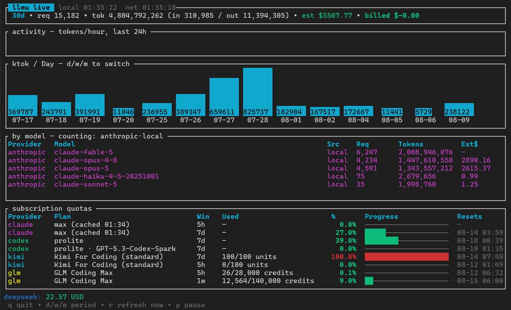

# llmu — lean multi-provider LLM usage reporter

One tiny, fast, cross-platform binary that answers: *how much am I using, what
is it costing, and how close am I to my limits* — across Anthropic, OpenAI,
DeepSeek, Kimi (Moonshot), GLM (Z.ai/Zhipu), Gemini and Qwen (Alibaba Cloud
Model Studio / QwenCloud), covering both pay-as-you-go APIs and subscription
plans.

```
llmu usage --since 30d --by week --group-by provider,model
llmu usage --since mtd --provider anthropic --source local --json
llmu balance          # prepaid credit balances (DeepSeek, Kimi)
llmu quota            # subscription burn (Claude Code 5h window, GLM plan)
llmu tui              # interactive dashboard
```

No async runtime, no database, no daemon. Blocking HTTP (`ureq` + rustls),
OS threads for parallel fetches, in-memory aggregation, `ratatui` for the
dashboard. Release binary is a few MB, cold start is milliseconds.

## Demo



## Install

### Prebuilt binaries

Binaries for Linux (x86_64/aarch64, static musl), Windows (x86_64), and
macOS (Apple Silicon/Intel) are attached to each GitHub Release — download,
unpack, and put `llmu` on your `PATH`. Verify with the `.sha256` file next
to each archive. llmu releases are GitHub Release binaries and are
not published to crates.io.

### How releases work

Releases go through a Release Please PR, not pushed tags. Contributors put
user-facing notes under the `Unreleased` section of `CHANGELOG.md`; the
version bump follows Conventional Commits — `fix:` patches, `feat:` minors,
`!` or `BREAKING CHANGE` majors. Merging the release PR finalizes the
canonical CHANGELOG notes, creates a draft release and its tag, builds Linux
x86_64/aarch64 musl, Windows x86_64, and macOS Intel/Apple Silicon archives,
writes an adjacent SHA-256 file for each, and publishes only after every
asset passes. If asset publication ever fails, a manual `workflow_dispatch`
run with the existing `tag` input recovers it.

### From source

On any OS with Rust >= 1.75:

```sh
cargo build --release --locked      # target/release/llmu
llmu init                           # writes ~/.config/llmu/config.toml
llmu providers                      # check what's wired up
```

### Cross-compile

Local cross-compiles also work with `rustup target add <target>`; both
macOS architectures build on either Mac, and Linux->Windows works via
`cargo-xwin` or `cargo-zigbuild` if you prefer not to use CI.

## Live watch mode

`llmu watch` (alias of `llmu tui`) is a real-time dashboard on three
cadences: local Claude Code / Codex logs are re-parsed every 3 s
(mtime-filtered, so it costs milliseconds), usage APIs and billed cost
every 60 s, and quotas and balances every 300 s. Quotas are slowest on
purpose. Anthropic's `oauth/usage` endpoint throttles at roughly a poll a
minute and answers **429**, at which point llmu falls back to
last-known-good meters — so polling it on the usage cadence used to park
the dashboard inside the throttle window and freeze the Anthropic
percentages for as long as it stayed open. A throttled quota tick now
doubles its own interval (capped at 30 min) and snaps back to the
configured cadence on the first live answer. Tune with `--local-refresh`
/ `--refresh` / `--quota-refresh` (floor 15 s for usage, 30 s for
quotas). The view: 24 h ktok/hour sparkline, per-period bar chart,
per-provider colored model table, threshold-colored quota gauges
(green < 60 % < yellow < 85 % < red), balances. Meters that are not live
are never shown as if they were: the quota panel title turns yellow and
names the provider, when its meters were last live, and when the next
attempt lands. Keys: `q` quit, `d/w/m` period, `r` force a network
refresh (both cadences, clearing any backoff, and bypassing the optional
HTTP cache for exactly that fetch — it is also remembered rather than
dropped if you press it while paused), `p` pause. `llmu --fresh tui`
bypasses the raw cache only for the initial full network fetch; later
scheduled refreshes honor the TTL.

Plain CLI output is colorized too when stdout is a terminal; `NO_COLOR`
disables it, `CLICOLOR_FORCE=1` forces it (e.g. through a pager).

## Zero config

Bare `llmu` works with no setup: it auto-detects credentials and logs that
other tools already left on the machine — read-only discovery, sent only to
the provider's own API — and shows quotas + a 7-day summary
immediately. The one exception to read-only discovery is a validated OAuth
refresh of a supported plaintext Gemini CLI or Claude Code credential file
(see `docs/providers.md`); API keys, encrypted stores, and OpenCode access
tokens are never touched. Detected sources:

| Source | What it unlocks |
|--------|-----------------|
| `~/.claude/projects/**/*.jsonl` | Claude Pro/Max token usage (local transcripts) |
| `~/.claude/.credentials.json` | live Claude session/weekly meters |
| macOS login keychain item `Claude Code-credentials` (override: `[claude] keychain_service`; `""` disables) | live Claude session/weekly meters where Claude Code stores its token on macOS — read **read-only** — llmu never writes to a keychain, so Claude Code keeps owning token rotation |
| `~/.claude/settings.json` `env` block | GLM / Kimi-Code / DeepSeek keys from routed Claude Code setups (`ANTHROPIC_BASE_URL` decides which) |
| `$CODEX_HOME` (`~/.codex`) sessions + `auth.json` | ChatGPT-plan usage + 5h/weekly limits |
| OpenCode `auth.json` (`~/.local/share/opencode` default; `XDG_DATA_HOME/opencode`, override: `OPENCODE_DATA_DIR`) | DeepSeek / Z.ai / Moonshot keys, Claude OAuth fallback |
| OpenCode `opencode.db` (same directory resolver, default `~/.local/share/opencode/opencode.db`) | read-only local usage records mapped to qwen / glm / deepseek / kimi / openai — additive with APIs and client logs (possible overlap, no request dedup) |
| kimi-cli `~/.kimi/credentials/*.json` (override: `KIMI_SHARE_DIR`) | Kimi For Coding quota |
| `~/.gemini/oauth_creds.json` (override: `[gemini] credentials` / `GEMINI_CLI_HOME`) | Gemini Code Assist quotas (plaintext OAuth, auto-refreshed; encrypted/keychain stores unsupported) |
| `~/.qwen/settings.json` `env` block + `usage/` ledgers (override: `[qwen]` home/runtime, `QWEN_HOME`, `QWEN_RUNTIME_DIR`) | Qwen (Alibaba Cloud Model Studio) local request/legacy usage records — read-only, no Qwen network call; QwenCloud account quota/billing stays console-only |
| env vars | `ANTHROPIC_ADMIN_KEY`, `OPENAI_ADMIN_KEY`, `DEEPSEEK_API_KEY`, `MOONSHOT_API_KEY`/`KIMI_API_KEY`, `KIMI_CODE_API_KEY`, `ZAI_API_KEY`/`ZHIPU_API_KEY`, `ANTHROPIC_AUTH_TOKEN`+`ANTHROPIC_BASE_URL`, `DASHSCOPE_API_KEY`/`BAILIAN_API_KEY`, `BAILIAN_CODING_PLAN_API_KEY`, `BAILIAN_TOKEN_PLAN_API_KEY`, `QWEN_HOME`, `QWEN_RUNTIME_DIR`; plain `ANTHROPIC_API_KEY`/`OPENAI_API_KEY` are used only when admin-grade (`sk-ant-admin…`/`sk-admin…`) |

Precedence: explicit `config.toml` > env vars > discovered files.
`llmu providers` shows exactly where every credential came from, labeled
read-only except supported plaintext OAuth refresh.


## The honest data-availability matrix

The single most important design fact: **providers expose wildly different
data**, and subscription plans mostly expose *nothing* officially. llmu
normalizes three record types instead of pretending everything is uniform:

| Provider  | Usage history (tokens/model/day) | Billed cost | Balance/credits | Subscription % |
|-----------|----------------------------------|-------------|-----------------|----------------|
| Anthropic API | ✅ Admin Usage API (cached/uncached/cache-write/output, per model, per day, server-tool counts) | ✅ Cost API | – | – |
| Claude Pro/Max (Claude Code) | ✅ local `~/.claude/projects/**/*.jsonl` transcripts | est. only | – | ✅ live Session/Weekly/Sonnet % via `api.anthropic.com/api/oauth/usage` (Claude Code OAuth token) |
| OpenAI API | ✅ org Usage API (incl. cached input, request counts) | ✅ Costs API | – | – |
| ChatGPT plan (Codex CLI) | ✅ local `$CODEX_HOME/sessions/**/*.jsonl` (`token_count` events) | est. only | – | ✅ 5h + weekly % via `chatgpt.com/backend-api/wham/usage` (Codex OAuth), fallback: `rate_limits` in the same logs |
| DeepSeek | ❌ (no history API) | ❌ | ✅ `/user/balance` (granted vs topped-up, CNY/USD) | – |
| Kimi / Moonshot | ❌ | ❌ | ✅ `/v1/users/me/balance` (cash/voucher/available) | ✅ Kimi For Coding weekly + windowed limits via `api.kimi.com/coding/v1/usages` |
| GLM (Z.ai / bigmodel.cn) | ⚠️ model-usage endpoint (best effort) | ❌ | – | ✅ Coding-Plan session/weekly % + tool quota via `/api/monitor/usage/quota/limit` |
| Gemini API | ⚠️ client-side: log `usageMetadata` per response | via Google Cloud Billing only | – | ✅ Code Assist quotas via Gemini CLI OAuth (auto-refreshed) |
| Qwen (Alibaba Cloud Model Studio / QwenCloud) | ✅ local Qwen Code records (request ledger + legacy session summaries; routed Claude Code `qwen*` rows included) | est. only — no built-in Qwen price guesses | – | – (QwenCloud analytics/quota/billing is console-only; no inference-key account API) |
| OpenCode (local usage records) | ✅ local `opencode.db` message records → qwen / glm / deepseek / kimi / openai (additive with APIs/client logs) | est. only | – | – |

Legend: ✅ official API · ⚠️ workaround (local logs / undocumented endpoint) · ❌ not exposed.

Consequences baked into the design:

- **Estimated vs billed cost are never mixed.** Per-model rows show
  *estimated* cost from a user-editable `[pricing]` table; authoritative
  amounts from the Anthropic/OpenAI cost APIs are shown as a separate
  "Billed" section. Totals never double-count.
- **Balance-only providers get a snapshot store.** Every `llmu balance`
  appends to `~/.local/share/llmu/balances.jsonl`; day-over-day deltas are a
  derived spend series (`llmu balance --history`).
- **Subscription usage comes from local logs**, the same way ccusage does it:
  Claude Code writes per-message token usage into JSONL transcripts; llmu
  parses, dedupes on `(message.id, requestId)`, and buckets hourly so the
  rolling 5-hour window is cheap to compute.

## OpenCode local usage records

OpenCode's local SQLite database (`~/.local/share/opencode/opencode.db`, or
`XDG_DATA_HOME/opencode` / `OPENCODE_DATA_DIR` — the same resolver that
finds `auth.json`) holds per-message usage records for many providers. `llmu
usage` reads completed assistant records read-only and reports them under
llmu's canonical provider ids (qwen / glm / deepseek / kimi / openai); see
`docs/providers.md` for the exact provider-id allowlist, eligibility rules,
and trust boundary. `llmu providers` shows a standalone `opencode` row that
is `yes` only when the database is readable and holds an eligible record.

OpenCode records are additive with provider APIs and other client logs: a
request run through OpenCode may also appear in another feed (possible
overlap), llmu never deduplicates across sources, and only the
`[pricing]`-table estimate is shown for them — never a billed or account
amount from OpenCode.

Reproduce a Qwen-through-OpenCode setup:

```
llmu providers                         # opencode row should be "yes"
llmu usage --since 7d --provider qwen  # Alibaba OpenCode records under qwen
llmu usage --since 7d --provider qwen --model qwen-plus   # model substring
llmu usage --since 7d --provider qwen --source local      # local records only
```

## Configuration

`llmu init` writes a commented sample. Every key falls back to an env var
(`ANTHROPIC_ADMIN_KEY`, `OPENAI_ADMIN_KEY`, `DEEPSEEK_API_KEY`,
`MOONSHOT_API_KEY`, `ZAI_API_KEY`/`ZHIPU_API_KEY`). Note that Anthropic and
OpenAI need **org admin keys** (not regular API keys) for their usage/cost
endpoints.

Pricing for cost *estimates* lives in `[pricing]` as
`"model-prefix" = [input, output, cache_read, cache_write]` USD per 1M
tokens — longest matching prefix wins, defaults ship in the binary but should
be verified against provider pricing pages.

`[http_cache] ttl_seconds` opts into raw HTTP GET caching (zero disables it —
see "Optional HTTP response cache"). `[gemini]` accepts optional
`credentials` and `project` overrides for Code Assist quotas (see
`docs/providers.md`). Credential discovery stays read-only except validated
plaintext Gemini/Claude OAuth refresh.

`[qwen]` configures Qwen (Alibaba Cloud Model Studio / QwenCloud) usage,
read from local Qwen Code records — llmu makes no Qwen network call and adds
no built-in Qwen price guesses. The three key classes are
**not interchangeable** — standard (`DASHSCOPE_API_KEY`, then
`BAILIAN_API_KEY`), Coding Plan (`BAILIAN_CODING_PLAN_API_KEY` only), and
Token Plan (`BAILIAN_TOKEN_PLAN_API_KEY` only); an `sk-sp-*` prefix never
identifies a plan class, and the base URL families differ per class (see
`docs/providers.md`). Qwen home precedence: `[qwen].home` > `QWEN_HOME` >
`~/.qwen`. Runtime precedence: `[qwen].runtime_dir` > `QWEN_RUNTIME_DIR` >
settings `advanced.runtimeOutputDir` (relative values anchor under the
effective Qwen home) > effective Qwen home. QwenCloud account analytics,
quota, and billing are console-only — llmu never uses browser cookies or a
console `sec_token`, and a key-only setup reports local records only.

## CLI reference

```
llmu usage
  --since 7d|24h|mtd|wtd|YYYY-MM-DD     window start (default 7d)
  --until YYYY-MM-DD                    window end (default now)
  --by day|week|month                   time bucket
  --group-by provider,model,source      extra grouping dimensions
  --provider anthropic,openai,...,qwen  provider filter
  --model sonnet                        substring model filter
  --source api|local                    billing API vs local logs
  --json                                aggregated rows as JSON
  --csv                                 same rows as RFC 4180 CSV (conflicts with --json)
llmu balance
  --json | --csv                        snapshot rows (conflict with each other)
  --history                             offline daily history from balances.jsonl
                                        (JSON/CSV/table; no network, no append)
llmu quota
  --json | --csv                        quota rows (conflict with each other)
llmu --fresh <command>                  bypass the optional HTTP cache for one run
llmu --fresh tui                        bypass only the initial full network fetch
```

## CSV output

`usage`, `balance`, `quota`, and `balance --history` accept `--csv`:
UTF-8, LF line endings, RFC 4180 field escaping (comma, quote, CR, LF),
machine numeric cells (shortest float round-trip, no thousands
separators), lowercase booleans, and exactly one header row — empty
results still emit the header. Notes always stay on stderr and never
contaminate CSV (or JSON) stdout. `--csv` conflicts with `--json`, and
clap rejects the combination before any provider request or store
mutation.

- `usage --csv`: `period`, the `--group-by` columns in argument order
  (exact lowercase names `provider`, `model`, or `source`), then
  `requests`, `input_tokens`, `output_tokens`, `cache_read_tokens`,
  `cache_write_tokens`, `total_tokens`, `tool_calls`, `est_cost_usd`,
  `has_cost`.
- `balance --csv`: `provider,total,granted,topped_up,currency`
- `quota --csv`: `provider,plan,window,used,limit,unit,resets_at`
  (`resets_at` is RFC 3339 or empty)
- `balance --history --csv`: `from,to,provider,currency,opening,closing,spent,funded`

## Offline balance history

`llmu balance --history` reads the snapshots every `llmu balance` appends
to the platform data directory's `llmu/balances.jsonl`. It is fully
offline: no provider requests, appends no snapshot. Records group by
(provider, currency, UTC date); the record with the latest timestamp is
that day's close, with ties broken by the later JSONL line. Consecutive
daily closes within a provider/currency series produce one row per
interval with the actual UTC dates — `from`, `to`, `opening`, `closing`,
`spent`, and `funded` — so missing days stay visible as gaps instead of
being synthesized. A decrease sets `spent`, an increase sets `funded`,
and equality sets both to zero; currencies are never combined or
converted. Malformed/non-finite records are skipped and summarized once
in a stderr note with their count. A missing file is empty history; any
other read failure (permissions, disk) is surfaced as an error, never
silently treated as empty.

## Optional HTTP response cache

`[http_cache] ttl_seconds = 0` is the default and disables cache reads
and writes entirely. With a positive TTL, llmu stores the successful
JSON response of each individually opted-in, side-effect-free GET request
under the platform cache directory `llmu/http` and replays it within the
TTL. Eligibility is per call site: OAuth token exchanges, Gemini quota
POSTs, failed responses, and local-file reads are never cached. Each
entry is keyed by the lowercase SHA-256 of the uppercase method, URL, and
every header pair (including `Authorization`), so one account can never
receive another account's cached body and no raw URL, key, or token ever
appears in filenames or entry metadata. Entries record their original
observation time; expired, future-dated, or corrupt entries fall back to
a live request with a one-line secret-free stderr note, and cache trouble
never fails a successful response. A raw cache hit never advances the
last-known-good quota cache's timestamp.

The global `--fresh` flag bypasses cache reads for one-shot commands
while still storing successful live responses. In the TUI it applies only
to the initial full network fetch; each `r` keypress bypasses exactly its
next full network fetch, and scheduled refreshes otherwise honor the TTL.

## Architecture

```
src/
  types.rs        UsageEvent / BilledCost / QuotaSnapshot / BalanceSnapshot
  config.rs       TOML config + env fallback + pricing table
  http.rs         15-line blocking JSON GET (ureq)
  providers/      one adapter per provider, all behind trait Provider
  local/          claude_code.rs — subscription usage from JSONL transcripts
  report.rs       aggregation (period × dynamic groups) + table renderer
  store.rs        append-only balance snapshots
  tui.rs          ratatui dashboard (totals, bar chart, table, quotas)
  main.rs         clap CLI, parallel fetch via std::thread::scope
```

Adding a provider = one file implementing `Provider` with whichever of
`usage() / quotas() / balances()` the provider actually supports.

## Roadmap

- [x] GLM Coding-Plan quota (`/api/monitor/usage/quota/limit`)
- [x] Kimi For Coding quota (`api.kimi.com/coding/v1/usages`)
- [x] Claude Pro/Max live limits (`/api/oauth/usage` via Claude Code OAuth token)
- [x] Codex CLI local session logs + ChatGPT-plan limits (`wham/usage`)
- [x] Gemini CLI / Code Assist quota (`loadCodeAssist` + `v1internal:retrieveUserQuota`; Gemini CLI plaintext OAuth credentials, auto-refreshed — see docs/providers.md)
- [x] Anthropic OAuth token auto-refresh (proactive five-minute refresh + one reactive 401 retry for Claude Code file-backed credentials)
- [x] Qwen (Alibaba Cloud Model Studio / QwenCloud): local Qwen Code request/legacy usage via `[qwen]` config + Qwen Code settings discovery; no console API (see docs/providers.md)
- [x] `llmu balance --history` (spend deltas from snapshots)
- [x] `--csv` output; optional local response cache with TTL (`[http_cache] ttl_seconds`)

The endpoints marked "undocumented" were sourced from the providers' own CLIs and
open-source trackers (openusage, CodexBar, kimi-cli, opencode-glm-quota); they can
change without notice. llmu treats every one as best-effort and degrades gracefully.

## Troubleshooting

**"X detected but shows nothing"** — every configured source now explains
itself with a `note:` on stderr instead of staying silent. The common ones:

- `kimi: wallet balance skipped — only a Kimi For Coding key…` — Kimi has
  two unrelated credentials: the **For Coding** plan key (quota endpoint,
  auto-discovered from OpenCode/kimi-cli) and the **open-platform**
  `MOONSHOT_API_KEY` (wallet balance). Having one doesn't imply the other.
- `claude: oauth/usage 401 persists after one refresh — log in again with
  Claude Code` — file-backed credentials retry once with a forced refresh;
  if the 401 persists, the refresh token is invalid and only a new
  `claude` login cures it. For OpenCode access tokens, refresh Anthropic
  authentication in OpenCode or configure Claude Code credentials; llmu
  cannot refresh direct access tokens.
- `oauth/usage returned HTTP 429: either the endpoint is throttling … or
  the access token is expired/revoked` — `oauth/usage` answers **429, not
  401**, for a dead token, so pure "rate-limited" wording would be
  misleading on a source llmu cannot refresh. Retry once; if it persists,
  re-authenticate the client that owns the token. llmu refreshes only
  plaintext `claudeAiOauth` files, never a borrowed access token and
  never a keychain item.
- `Claude Code's keychain access token has expired — run any Claude Code
  command to refresh it` — llmu reads the macOS keychain item read-only.
  Refreshing would rotate the refresh token without being able to update
  the keychain atomically, which would log you out of Claude Code, so
  rotation stays Claude Code's job.
- `claude: no "Claude Code-credentials" keychain item, and
  CLAUDE_CONFIG_DIR is set` — Claude Code scopes the keychain item name
  per config directory (`Claude Code-credentials-<hash>`). The suffix is
  not derivable, and a keychain often holds many such items, so llmu
  declines to guess: find yours with
  `security dump-keychain | grep 'Claude Code-credentials'` and set
  `[claude] keychain_service` to that exact name.
- `gemini: quota: Gemini CLI encrypted/keychain credential storage is
  unsupported…` — `oauth_creds.json` is absent but the sibling
  `gemini-credentials.json` encrypted marker exists. Run `gemini` once to
  export plaintext credentials, or point `[gemini] credentials` at a
  plaintext copy; llmu never reads or modifies encrypted stores.
- `Code Assist onboarding is incomplete…` / `your account is ineligible…` —
  run `gemini` to complete onboarding or validation; llmu never onboards
  or mutates accounts.
- `your Code Assist tier requires a project…` — set `[gemini] project` or
  `GOOGLE_CLOUD_PROJECT` (a project returned by `loadCodeAssist` wins).
- `codex: wham/usage failed… no rate_limits in session logs` — run
  `codex` once to refresh its token / produce a session.
- `qwen: skipped N malformed local usage record(s)` — a Qwen Code ledger
  line has an unsupported schema version or invalid fields; llmu skips it
  with one aggregate note and never prints record bodies, paths, or keys.
  If Qwen Code upgraded its schema, this usually resolves itself after new
  records arrive.
- `qwen: skipped N unreadable local usage file(s)` — a
  `usage/token-usage-*.jsonl` file cannot be read (permissions or a
  directory at the path); other files still count.
- `qwen` shows as configured but no usage appears — a key was found (env,
  config, or `~/.qwen/settings.json`) but there are no local Qwen Code
  records yet. llmu never calls a QwenCloud account API: analytics,
  quota, and billing are console-only, and no built-in Qwen price guesses
  exist (add `[pricing]` entries to estimate).
- `…responded but no meters were parsed (payload drift?)` — the
  undocumented endpoint changed shape. Rerun with `LLMU_DEBUG=1` to dump
  every request URL + response body, and compare against
  `docs/providers.md`.

**`Est$` shows `–` for some rows** — that model id has no `[pricing]`
entry (longest-prefix match). Add one to `~/.config/llmu/config.toml`.

## What each panel counts

The header totals, activity sparkline, bar chart, and by-model table sum
**only sources that produce usage events**: local Claude Code transcripts,
local Codex session logs, Qwen Code's local request/legacy ledgers (plus
routed Claude Code `qwen*` rows), OpenCode's local message records (mapped
to qwen / glm / deepseek / kimi / openai), the Anthropic/OpenAI org usage
APIs (admin keys), GLM's model-usage endpoint (best effort), and the Gemini
usage log. Both UIs print exactly which feeds are being counted, and which
configured providers can't contribute:

- **DeepSeek** exposes no usage/history API at all — only a wallet
  balance — so it can never appear in usage panels from its own API.
- **Kimi**, **Claude Pro/Max**, and **Gemini Code Assist** expose quota
  meters (percentages or token units), not per-model token histories.
- **Qwen** is counted from local Qwen Code records; a key-only Qwen setup
  with no records yet appears as configured but contributes no rows, and
  QwenCloud quota/billing is never fetched (console-only).

**Routed coding plans are the exception that works.** If Claude Code is
pointed at GLM / Kimi / DeepSeek / Qwen via `ANTHROPIC_BASE_URL`, those
requests land in your local transcripts with the real model ids — llmu
attributes them to the actual provider (a `glm-4.7` event shows under `glm`,
a `qwen-plus` event under `qwen`), prices them with the per-model `[pricing]`
table as "API-equivalent cost", and keeps them out of the Claude 5h burn
meter. Qwen Code's own ledgers and these routed transcript rows represent
disjoint client requests and stay additive — llmu never deduplicates across
clients. That makes local transcripts the single best usage feed for
subscription plans that publish no usage API.
